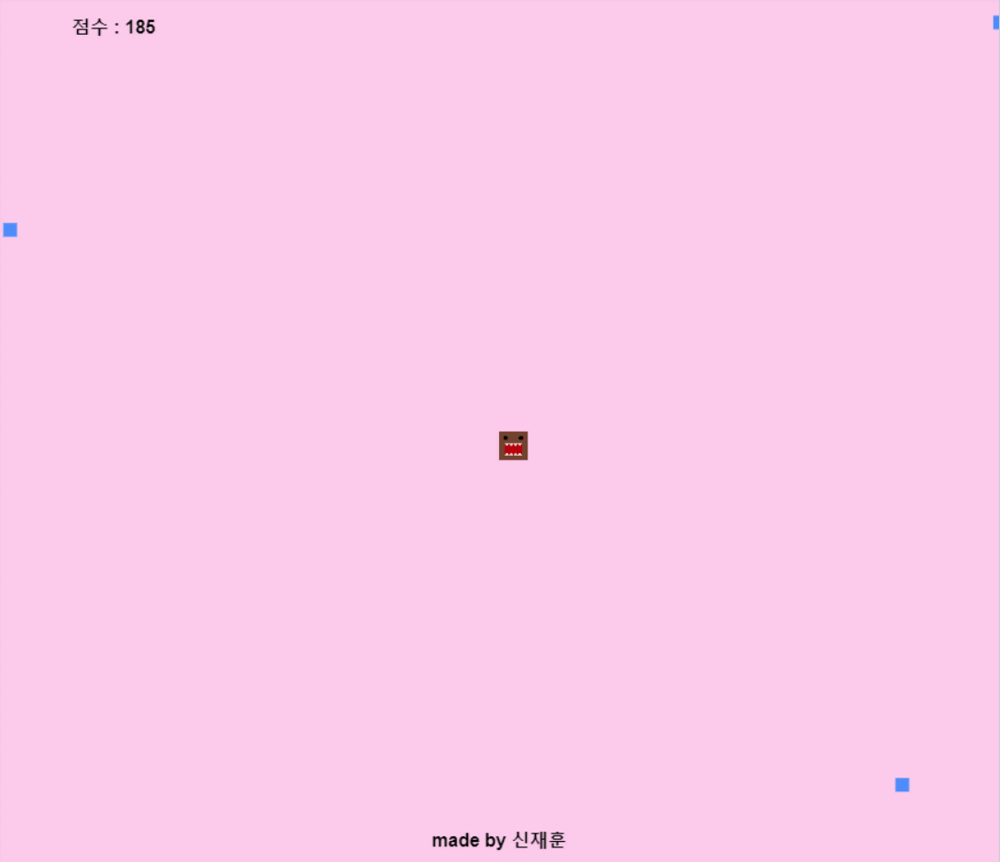
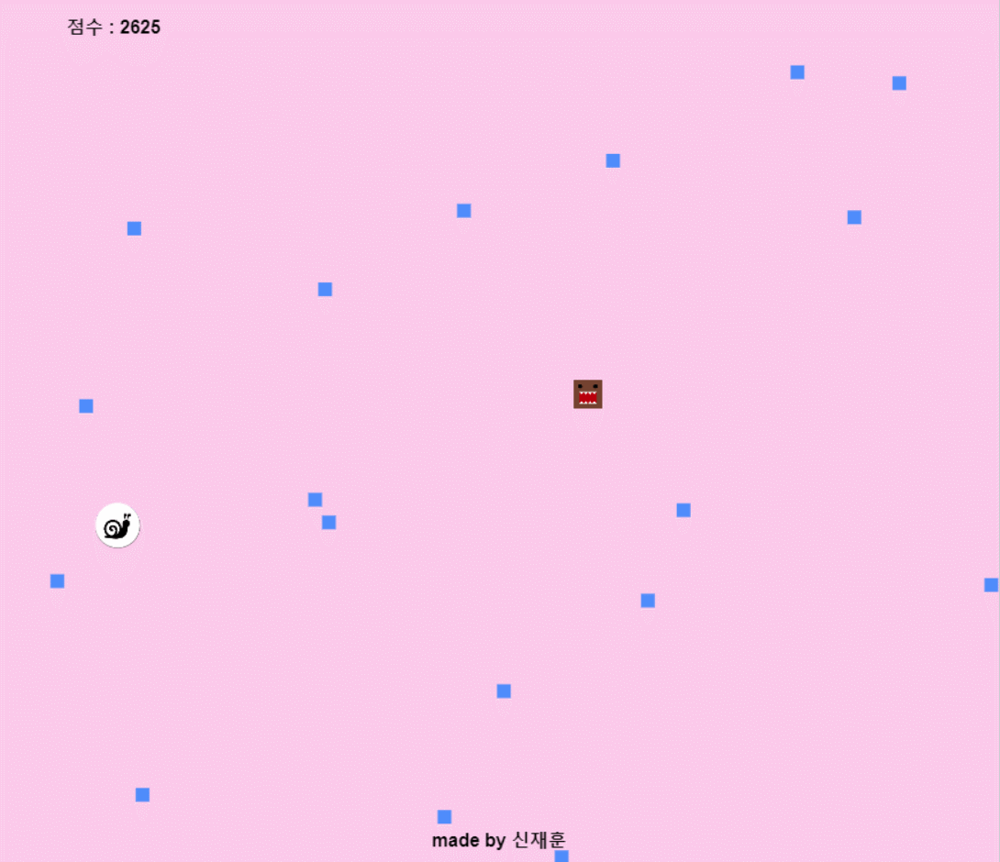
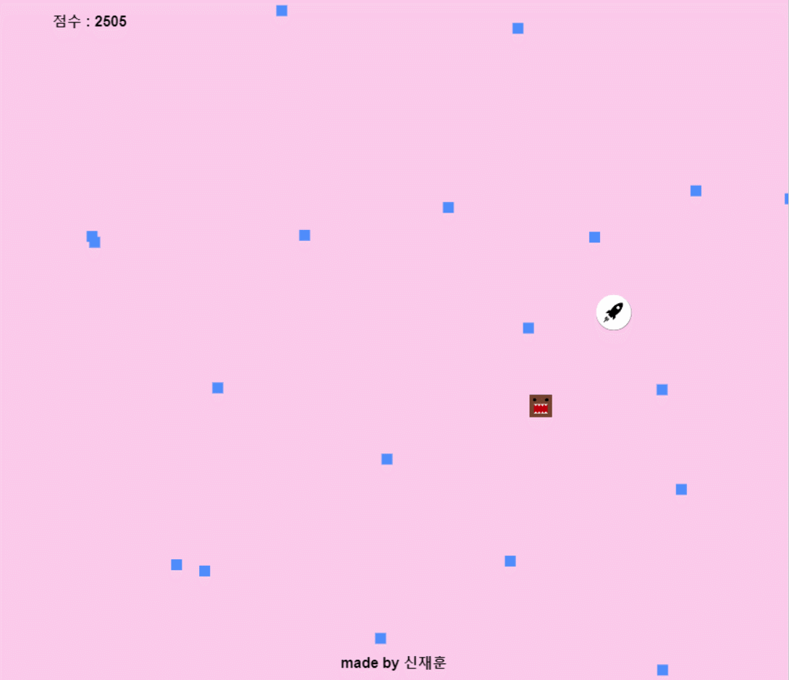
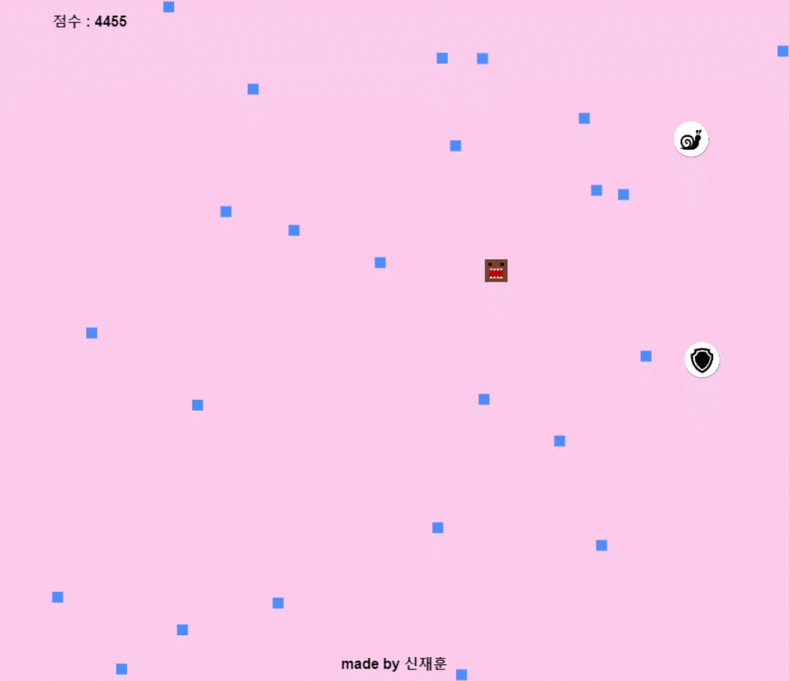
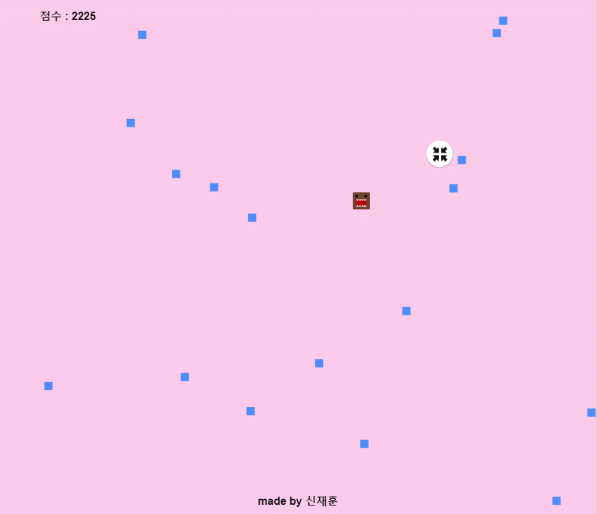

<h1 align="center">Welcome to Dodge Game👋</h1>

<br>

### 🏠 [HomePage](https://dodge-bit.netlify.app/)  


<br>

## :page_with_curl: ​Description

> 방향키/드래그로 적을 피하는 게임입니다
<br>

### 개요

- 아이템을 활용하여 높은 점수를 기록해보세요!

<br>

### 주요기능

- PC/Mobile에서 플레이 가능합니다.
- 모든 아이템은 중첩 적용이 가능합니다.
- css Image Sprite를 사용하여 이미지 로딩이 빠릅니다.
- IE에서 플레이 가능합니다.

<br>


## :mag: Overview

<br>

### Slow Item



<br>

### Star Item


<br>

### speed Item



<br>

### shield Item



<br>

### minimize Item



<br>

<br>

<br>

## :wrench: ​Tech Stack

- webpack  `5.30.0`


<br>
<br>

## :runner: Steps to run

```bash
$ npm install 
$ npm run start
```


